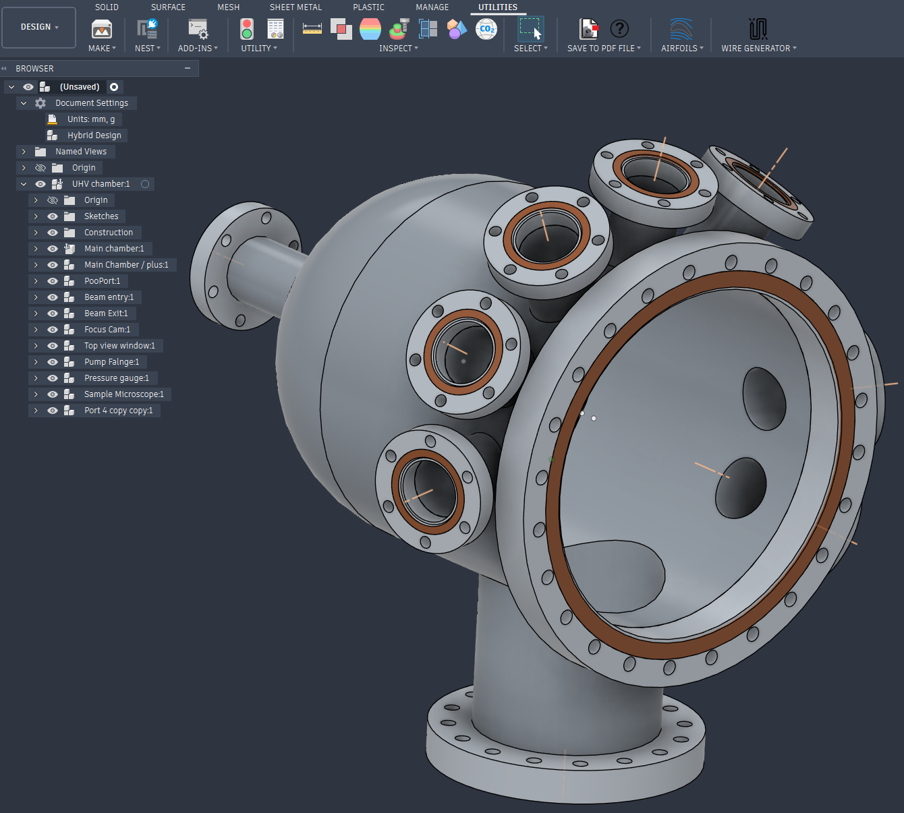
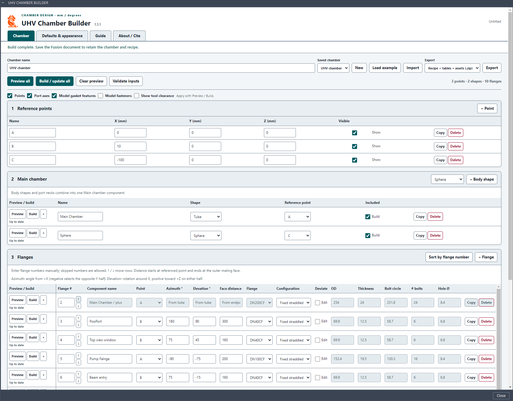

# UHV Chamber Builder

Plan, visualize and document vacuum chambers in **Autodesk Fusion** using three tables: **reference points → main chamber → flanges**.

**Version 1.3.1 · Windows / macOS · Apache-2.0 · Amon P. Lanz**

**[Download the add-in](UHVChamberBuilder_v1.3.1.zip?raw=true)** · [Example chamber](UHV_EXAMPLE_chamber.zip?raw=true) · [Source code](UHVChamberBuilder_v1.3.1/UHVChamberBuilder/) · [Report an issue](https://github.com/AmLanz/UHV-Chamber-Builder/issues)

## What it does

- Combine spheres, tubes, cuboids and selected solids into a main chamber.
- Add separate CF flange components; connect and merge their port necks.
- Preview and build individual rows or the whole chamber.
- Keep flange numbers stable and export recipes, dimension tables and documentation.

Optional gasket features, fasteners and tool-clearance envelopes help visualize the layout. Dimensions are in **mm**, angles in **degrees**. Light and dark themes are available.

## Installation

Requires desktop Autodesk Fusion. No separate Python installation or packages are needed.

1. **[Download UHVChamberBuilder_v1.3.1.zip](UHVChamberBuilder_v1.3.1.zip?raw=true)** and extract it to a permanent location.
2. Keep the inner **UHVChamberBuilder** folder intact. It directly contains `UHVChamberBuilder.py`, `UHVChamberBuilder.manifest`, `ui/`, `assets/` and `data/`.
3. In Fusion’s **Design** workspace, open **Utilities → Add-Ins → Scripts and Add-Ins** (or press **Shift+S**).
4. On **Add-Ins**, click **+**, choose **Script or add-in from device** if prompted, and select the inner **UHVChamberBuilder** folder.
5. Select the add-in and click **Run**. Check that the window shows **1.3.1**. **Run on Startup** is optional.

**Updating:** save your design, stop the add-in and replace the complete contents of its registered folder. Restart Fusion and run the updated add-in.

## Try the example

1. Download **[UHV_EXAMPLE_chamber.zip](UHV_EXAMPLE_chamber.zip?raw=true)**; leave this recipe ZIP intact.
2. Open a Fusion design, run the add-in and choose **Import** to select the example ZIP.
3. Choose **Preview all**, then **Build / update all**. Confirm the switch to **Hybrid** if prompted.
4. Edit the tables and save your Fusion document. **+** beside a row reveals extra settings.

Body shapes and port necks form **Main chamber**; each flange is a separate component. Enter unique flange numbers manually; skipped numbers are allowed.

## Documentation

- [Usage and troubleshooting](UHVChamberBuilder_v1.3.1/UHVChamberBuilder/docs/USAGE.md), including the X-axis azimuth/elevation convention.
- [CF dimensions and sources](UHVChamberBuilder_v1.3.1/UHVChamberBuilder/docs/CF_DIMENSIONS.md).
- [Changelog](UHVChamberBuilder_v1.3.1/UHVChamberBuilder/CHANGELOG.md).

This is a layout and reference tool. Seal details, rotatable retaining geometry and fasteners are schematic. Independently check dimensions, clearances and suitability before fabrication.

## License and citation

Copyright © 2026 **Amon P. Lanz**. Distributed under the **[Apache License 2.0](LICENSE)**; see [NOTICE](NOTICE). This independent project is not affiliated with, endorsed by or sponsored by Autodesk.

Citation is appreciated and optional:

> Amon P. Lanz (2026). *UHV Chamber Builder* (version 1.3.1). Computer software.  
> https://github.com/AmLanz/UHV-Chamber-Builder

Use **About / Cite** in the add-in to copy a citation or BibTeX entry. [CITATION.cff](CITATION.cff) and [CITATION.bib](CITATION.bib) are also provided.
